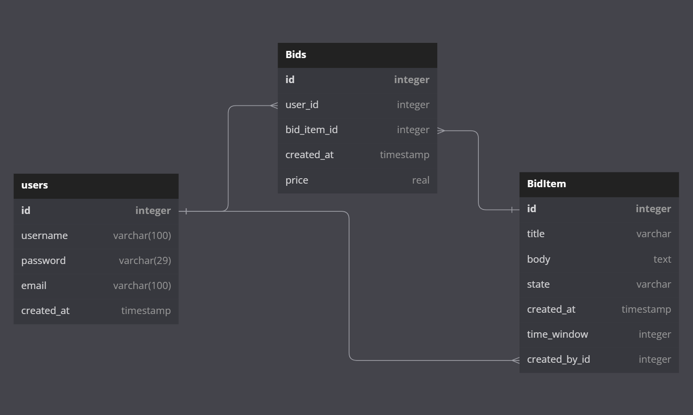
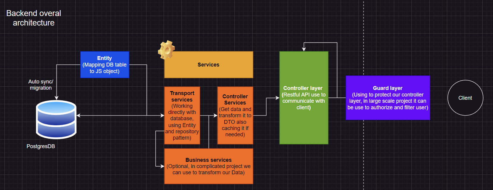
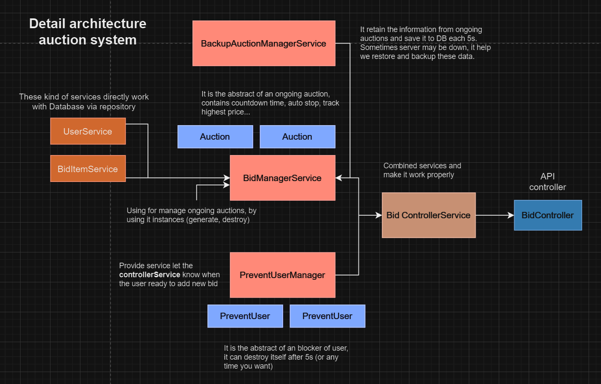
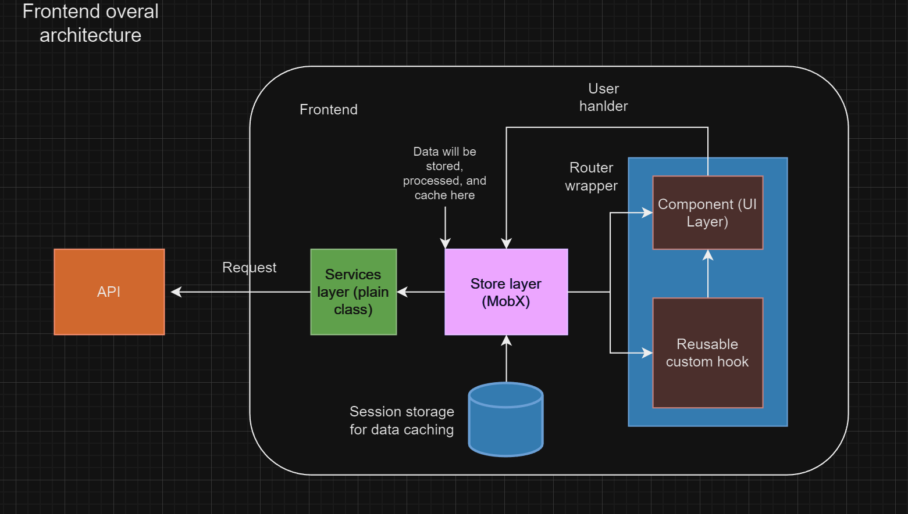
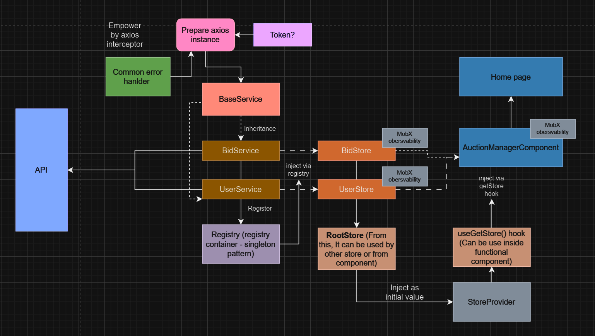

<h1>Jitera recruitment homework</h1>

## How to run this app with one command ㋡ ㋡ ?:
1. It's deadly simple. You need to install and run docker first (can see docker link [here](docs/Backend-instruction.md))
2. And run `yarn start:all` or `docker compose up`, that's it!

## 1. Project scope and proposal
### 1.1 Project stack
- **At backend side**: 
    - I use NestJS(NodeJS, Typescript), PostgreSQL (DB), TypeORM (Like entity framework)
    - Using Jest and an api client for writing integration test and UT
- **At frontend side**:
    - I use ReactJS, Typescript and ChakraUI (Build on top of react) for UI framework
    - Using Mobx for state management.

### 1.2 Database design
1. I use dbdiagram to design db: [database-diagram](https://dbdiagram.io/d/64ad4d4c02bd1c4a5ee03125)
2. Image:

### 1.3 Backend overal architecture
1. Visit [overal-backend-architecture](https://drive.google.com/file/d/1BkFiQJYe7gBx9fIgntwrFPdf5YmuH_aC/view?usp=sharing)
2. Diagrams:

### 1.4 Backend detailed architecture
The architecture of other parts are easy to understand so I will show the core part of our app: **Auction system**
1. Patterns using: Repository pattern, Dependency Injection, factory pattern.
2. Architecture of auction system: [diagram link](https://drive.google.com/file/d/1BkFiQJYe7gBx9fIgntwrFPdf5YmuH_aC/view?usp=sharing)
3. 

### 1.5 Backend setup locally
Please read [Backend instructon: docs/Backend-instruction.md](docs/Backend-instruction.md)

---

**NOTE**: In this project (**master** branch) I use minutes as a smallest time unit instead of hour so we can easily to test it, we can change it to hour version when everything become stable effortlessly

---

### 1.6 Frontend overal architecture
1. In Frontend I use singleton service pattern and mobx to manage our app store, below is [the diagram](https://drive.google.com/file/d/1hNYONmpp5uV4Jp5jp5-dmzBPPjP63Mh6/view?usp=sharing) 
2. Image: 

### 1.7 Frontend detailed architecture
1. I will explain the complicated parts of our app, **the auction system**, via the [detail diagram](https://drive.google.com/file/d/1hNYONmpp5uV4Jp5jp5-dmzBPPjP63Mh6/view?usp=sharing).
2. Image:

### 1.8 Frontend setup locally
Please read [Frontend instructon: docs/Frontend-instruction.md](docs/Frontend-instruction.md)

## Demonstration video
1. Intro

https://github.com/phanhuutoan/J-Auction/assets/73571447/af1682a1-25dd-410b-adfc-34910672bb98

2. Demo
https://youtu.be/X8fW8lg2T4s

