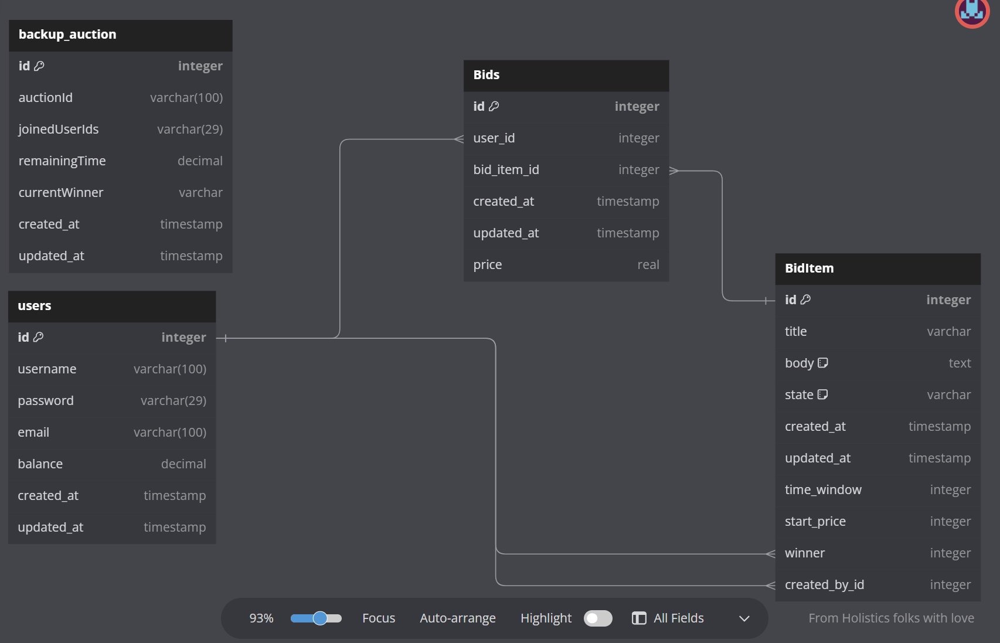

## 1. Project scope and proposal
### 1.1 Project stack
- **At backend side**: 
    - I use NestJS(NodeJS, Typescript), PostgreSQL (DB), TypeORM (Like entity framework)
    - Using Jest and an api client for writing integration test and UT
- **At frontend side**:
    - I use ReactJS, Typescript and ChakraUI (Build on top of react) for UI framework
    - Using Mobx for state management.

### 1.2 Database design
1. I use dbdiagram to design db: [database-diagram](https://dbdiagram.io/d/64ad4d4c02bd1c4a5ee03125)
2. Image:

### 1.3 Backend architecture
1. Visit [Database-overal-architecture](https://drive.google.com/file/d/1BkFiQJYe7gBx9fIgntwrFPdf5YmuH_aC/view?usp=sharing)
2. Diagrams:
