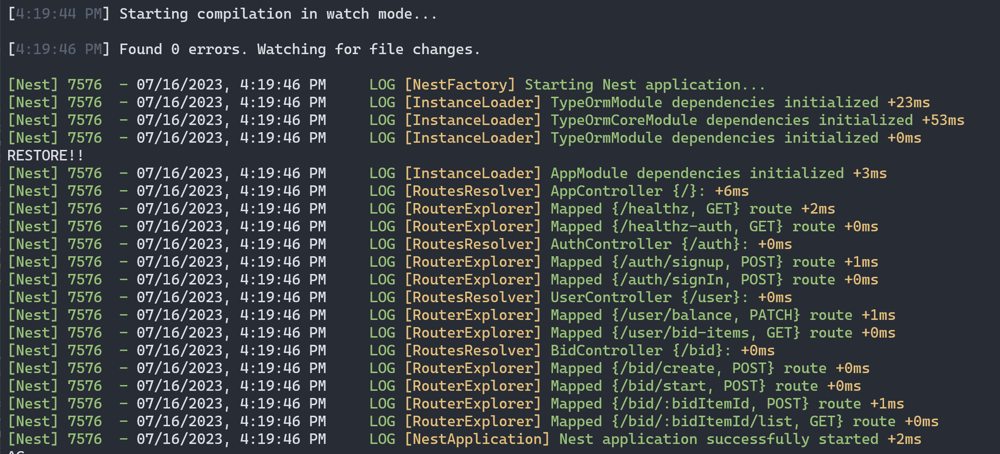
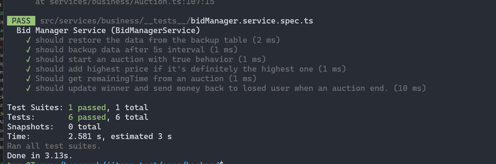
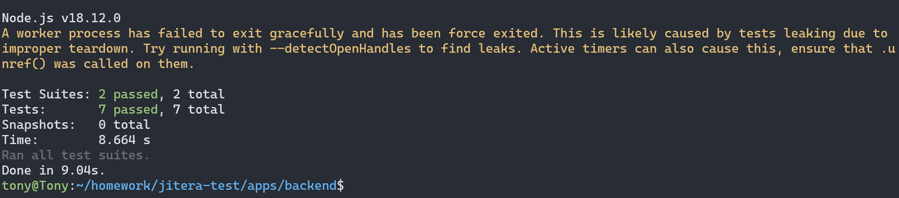

## Backend setup instruction
#### 1. Download and install docker and docker compose at: 
- link: [Docker link](https://www.docker.com/)
#### 2. Prepare environment variables:
- For backend, you can change any env as you want:
```js
POSTGRES_PASSWORD=Tony1234
POSTGRES_DB=jitera-db
POSTGRES_USER=postgres
DB_HOST=localhost
DB_PORT=5432
JWT_SECRET=jsonscret
```
#### 3. Running Database, I use posgreSQL:
- Use: `cd apps/backend`
- Run: `docker-compose up`
- Database is now can access via **localhost:5432** and admin board can access via  **localhost:8080**

#### 4. Setup and run locally
I recommend using **NodeJS 18.x**
- Use yarn: `yarn install`
- After installing dependencies use: `yarn start:dev`
- You may see something like this:
- 
- You can now access api via: **localhost:5050**
- If you want to test it via **postman**: I have prepared a collection for you to import, check it in **docs/postman_test__collections**

#### 5. About Unit test:
- Writing all unit test for this project may take a lot of time, so I choose one of complicated service to write UT (BidManagerService - for demo purpose): `apps/backend/src/services/business/bidManager.service.ts`
- Check the UT file here: [bidManagerSpec file](__tests__/bidManager.service.spec.ts)
- To run UT use `yarn test`
- Result: 


#### 6. About E2E test: 
- E2E is an important part of every serious application which make sure we won't create regression issue when adding new feature. I use jest and supertest to test the API server in our app. 
- checkout these E2E files in: `apps/backend/test`
- `apps/backend/test/app.e2e-spec.ts`: test app /healthz
- `apps/backend/test/auction-smoke.e2e-spec.ts`: test our app auctions system behavior. 
- Writing all of #p1 #p2 case by E2E may take huge time, so I choose complicated behavior to demo. 
- To run E2E use: `yarn test:e2e`, it requires you run the database on **step 3**
- Result:  You can entirely ignore the console error.