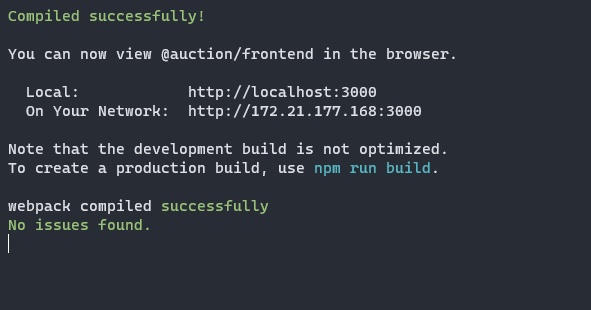
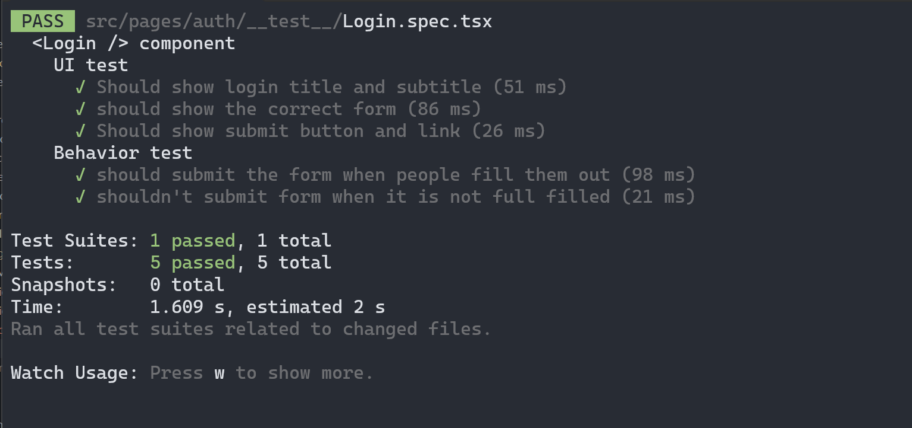
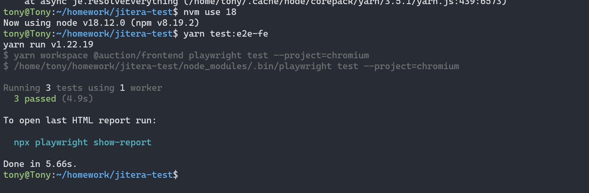

#### 2. Prepare environment variables:
- For frontend, you should add this env:
```js
REACT_APP_API_HOST="localhost:5000"
```
- Create .env file and add it to `apps/backend/.env`
#### 3. Preparation:
- Before running FE you should make sure the Backend API is running correctly. 
- By using 2 commands: `yarn start:db` and `yarn start:be`

#### 4. Setup and run locally
I recommend using **NodeJS 18.x**
- Use yarn: `yarn install` from root directory
- After installing dependencies use: `yarn start:fe`
- You may see something like this:
- 
- You can now access app via: **localhost:3000**

#### 5. About Unit test:
- Writing all unit test for this project may take a lot of time, I choose `Login component` to write UT sample: `apps/frontend/src/pages/auth/__test__/Login.spec.tsx`
- In here I show how we can mock custom react hook with **Jest** and **React-Testing-Library**
- Check the UT file here: [Login file](apps/frontend/src/pages/auth/__test__/Login.spec.tsx)
- To run UT use `yarn test:ut-fe`
- Result: 


#### 6. About E2E test: 
- E2E is an important part of every serious application which make sure we won't create regression issue when adding new feature. E2E in frontend check the way user interact with our app.
- I use **Playwright** for E2E testing, during the time installing it you may encounter some problems like install-deps or install playwright browser, just go ahead and do what it said  
- Checkout these E2E file in: `apps/frontend/e2e`
- To run E2E use: `yarn test:e2e-fe`, it requires you run the frontend locally on **step 4**
- Result: 